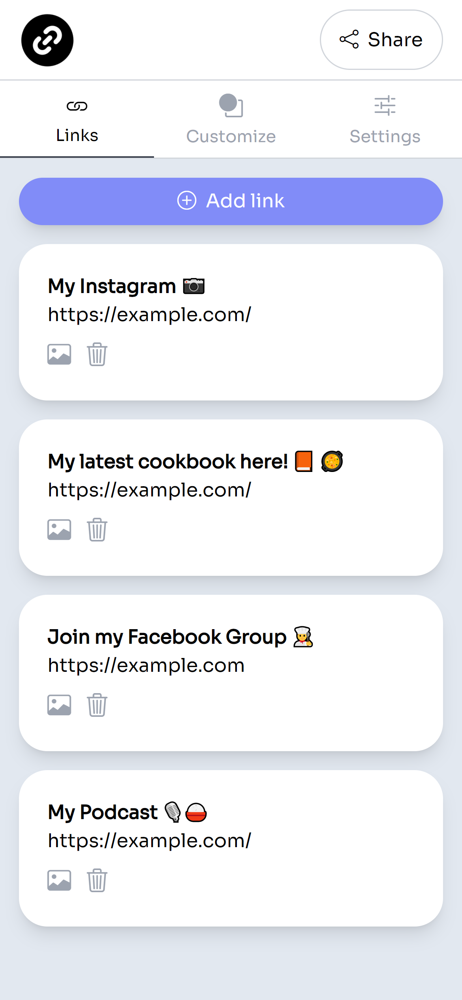
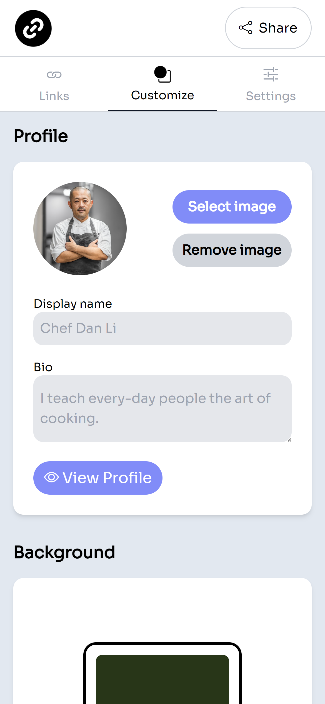
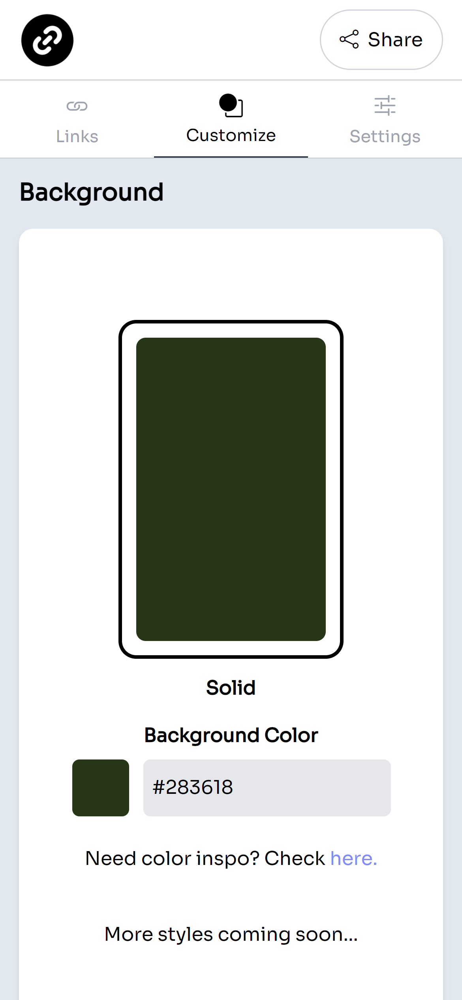
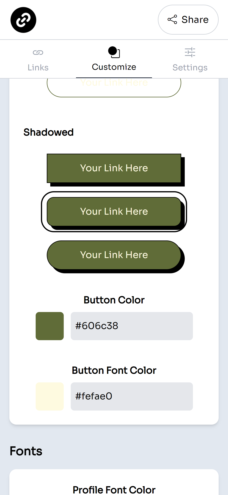
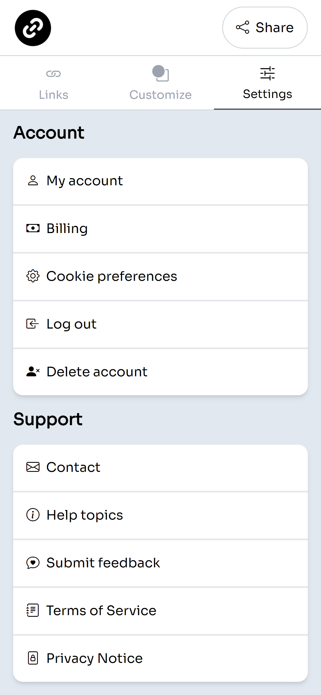

# Linkify

  
## Description

Linkify is an online platform that allows users to create a personalized profile where they can easily share all of their relevant links with others. Users can register with an email, username, and password, and start customizing their profile by selecting button styles and custom color schemes as well as add links for all of their relevant online profiles, such as their social media accounts, personal websites, and online portfolios.

Homepage


Login


Dashboard



Profile Customization






Shareable profile


## Table of Contents

- [Installation](#installation)
- [Usage](#usage)
- [License](#license)
- [Contributing](#contributing)
- [Tests](#tests)
- [Questions](#questions)

## Usage

Navigate to the [website](https://www.linkify.mobi/) to view create an account, edit your profile, add your links, and share your profile with anyone.

## Installation

This application requires NodeJS to run. Clone this repository to your local machine and run ```npm i``` to install required dependencies, then run ```npm start``` to initialize the server/database. The application may then be accessed in localhost.

## License
    
Licensed under the [MIT License](https://spdx.org/licenses/MIT.html)

## Contributing

No contributions to be accepted at this time.

## Tests

No further testing is planned for this project at this time.

## Questions

Have questions? Reach me at the following sources!

* GitHub: [realnifty](https://github.com/realnifty)
* E-mail: lovecore@pm.me
